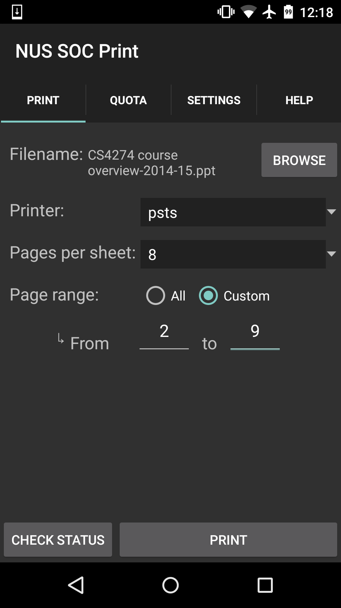
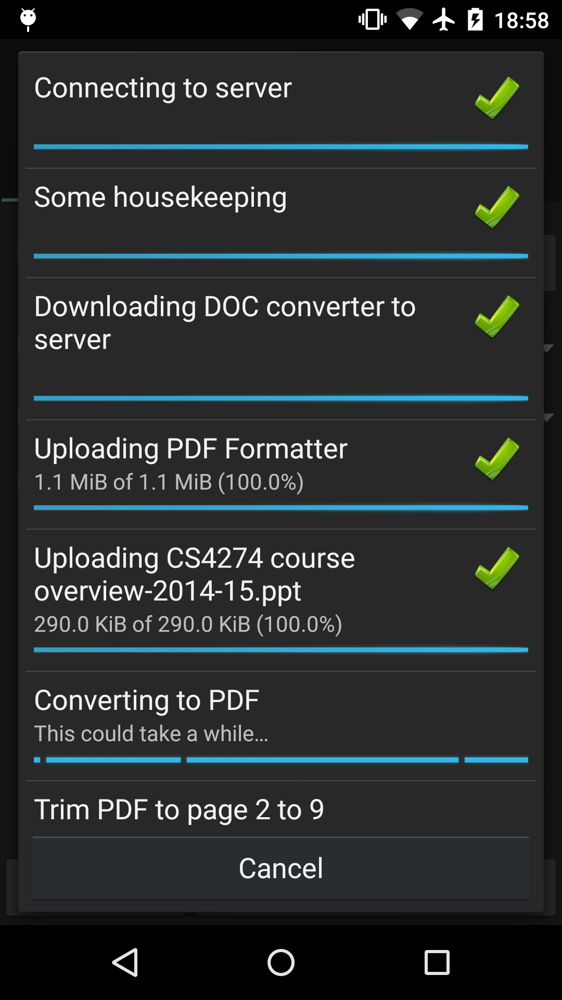
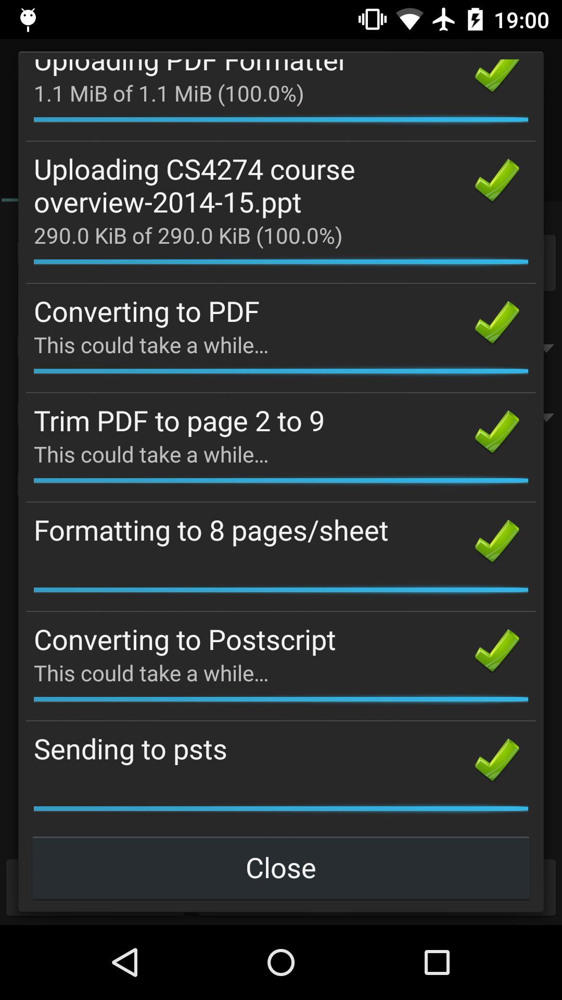
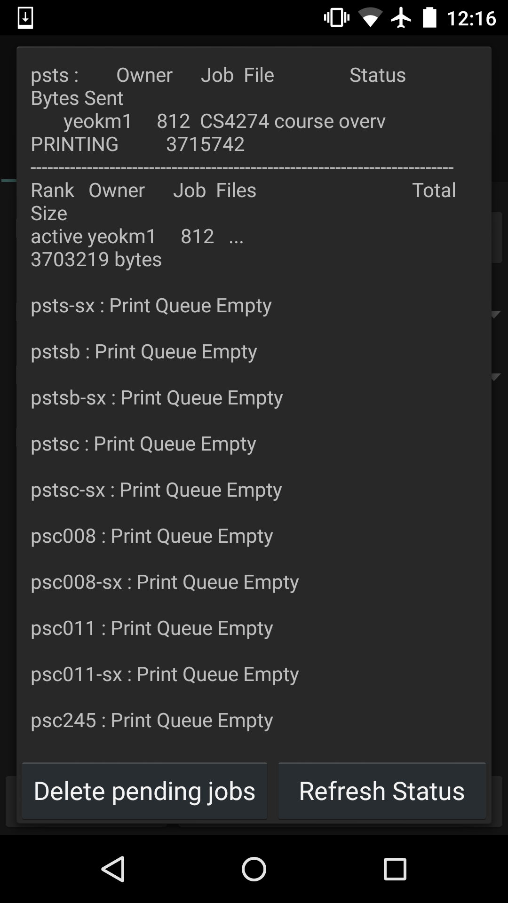
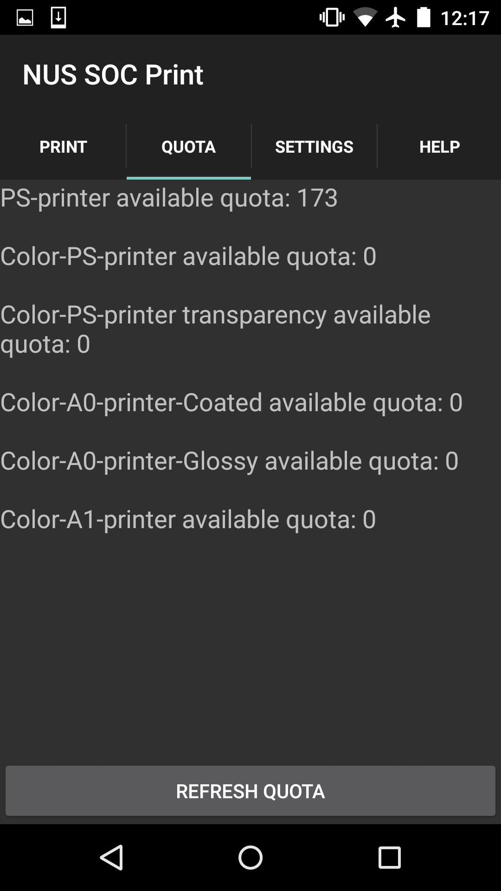

nus-soc-print
=============

An Android application that prints office documents and PDF files to Unix printers in NUS School Of Computing via SSH. The iOS version exists [here](https://github.com/yeokm1/nus-soc-print-ios/).

This app is published on the [Play Store](https://play.google.com/store/apps/details?id=com.yeokm1.nussocprintandroid). If you want to know more, I have written a user/dev guide that can be found in the [user-dev-guide](https://github.com/yeokm1/nus-soc-print/tree/master/user-dev-guide) directory.

##Features
1. Print PDF, DOC, DOCX, PPT, PPTX and ODT files
2. Page range to be printed
3. Remaining quota check
4. Print Status Check
5. Page formatting for documents
6. Accepts file sharing from other apps
7. Deleting of existing job in print queue
8. Runs on Android 2.1 and up for maximum compatibility

##Screenshots

##Build Tools
1. Java 8 Update 60 64 bit SDK
2. Android 6.0 SDK
3. Android Studio 1.3.2

##Libraries used
1. Jsch SSH library
2. Flurry Analytics (works only for Android 2.3.3 and above)
3. Crashlytics
4. [aFileChooser](https://github.com/iPaulPro/aFileChooser)
5. Docs to PDF converter. From [another project of mine](https://github.com/yeokm1/docs-to-pdf-converter).
6. Craft Support Email Intent. From [another project of mine](https://github.com/yeokm1/craft-support-email-intent).

##References
1. [PreferenceListFragment](https://github.com/artiomchi/AndroidExtensions/blob/master/AndroidExtensions/src/main/java/org/flexlabs/androidextensions/preference/PreferenceListFragment.java) and [Usage](http://blog.fordemobile.com/2012/11/display-preference-fragment-compatible.html)
2. [SSH example code](http://stackoverflow.com/questions/2405885/any-good-jsch-examples)
3. [nup_pdf PDF formatting library](http://blog.rubypdf.com/2007/08/24/how-to-make-n-up-pdf-with-free-software/)
4. [Multivalent PDF formatting library](http://multivalent.sourceforge.net/Tools/pdf/Impose.html)
5. [Merge 2 Git repos](http://blog.caplin.com/2013/09/18/merging-two-git-repositories/)
6. [Android Asset Studio](http://romannurik.github.io/AndroidAssetStudio/)
7. [Convert bytes to human readable form](http://stackoverflow.com/questions/3758606/how-to-convert-byte-size-into-human-readable-format-in-java)
